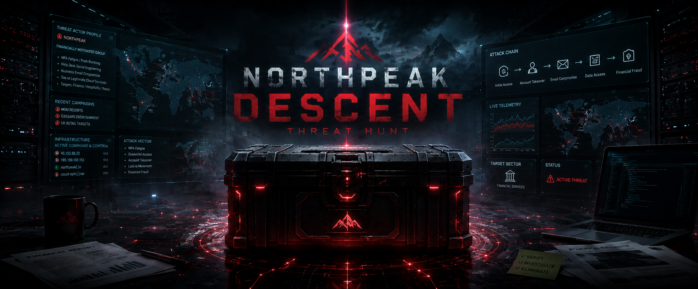

# Threat Hunt Report - Northpeak Descent

**Case:** NPT-INC-2026-0616 · Northpeak Logistics // Cyber Range SOC
**Platform:** Windows estate + Linux host (npt-ws01, npt-srv01, npt-linux01)
**Window:** Evening of 16 June 2026, roughly 20:00-00:30 UTC (intrusion window)


---

## 1. Complete Scenario

### Summary

Northpeak Logistics' estate lit up with a storm of failed logons on the evening of 16 June, and it read like a brute-force break-in. It wasn't. The real entry authenticated clean: a single external address, 148.64.103.173, rode straight in over RDP and worked the Windows estate interactively from the very first minute, landing on the workstation npt-ws01 before the server npt-srv01 was ever touched, upending the obvious assumption that Linux came first. From npt-linux01, the same sancadmin account ran a short, careful escalation check, tested reachability into the Windows estate through nothing more exotic than bash's /dev/tcp pseudo-device, and pulled down netexec to prepare the pivot. Back on npt-ws01, hands-on-keyboard activity rooted in Explorer.EXE separated the operator from the machine's own PowerShell chatter, and after a few trial runs a Run-key registry entry locked in logon persistence. Command and control ran across three look-alike subdomains, only one of which the network telemetry ever actually saw, the other two survived only in process command lines, and an obfuscated beacon decoded straight to a live callout carrying the compromised hostname. On npt-srv01, a second remote session, not the one that got them in, pushed a customer data export out over that same C2 channel at an evenly spaced, automated cadence. Through all of it, nothing was disabled and nothing was dropped: the entire operation ran on tools already sitting on the boxes. Overall, this is a **clean valid-account intrusion, cross-platform pivot, and low-noise exfiltration**, carried out with living-off-the-land tooling from end to end.

---

**// HUNT ASSIGNMENT // Northpeak Descent**

> **From: Hunt Lead // Cyber Range SOC**
> 
> **To: Threat Hunter // On-Shift**
>
> Re: Northpeak Logistics // post-intrusion investigation
>
> Someone got into the Northpeak Logistics estate on the evening of 16 June. Multiple footholds, parallel access. The operator held external remote access to the Windows infrastructure and also worked from a Linux host for reconnaissance and tooling. Between roughly 20:00 and 00:30 UTC they moved across the estate, staged tooling, set persistence, beaconed outbound, and reached the crown jewel.
>
> The logs are loud with failed logons, and it looks like a brute-force break-in. Do not take that at face value. The volume is a decoy. The real entry authenticated clean and never tripped a thing.
>
> What we do not yet know: which foothold came first, and how each host was reached · the internal pivot path and method · how persistence was configured, and on which host · the full C2 infrastructure and how the channel behaved · what sensitive data left, and from where.
>
>
> **// Hunt Lead, Cyber Range SOC**

---

### Live Announcement

> 🔵 **COMMUNITY HUNT // NORTHPEAK DESCENT // LIVE**

> An operator held the front door open while everyone watched the noise. Multiple footholds, two platforms, one intrusion. The failed-logon storm is bait, the real entry authenticated clean and never tripped a thing.
>
> Prove the order yourself. The obvious read has Linux first, Windows second. But it's not what the timeline says.
>
> Difficulty: **Intermediate**
>
> Flags: **18** // gate + 5 phases

---

### How To Hunt This [method, not answers]

A cross-platform intrusion worked end to end, Windows and Linux together. This is method, it will help you, it will not solve it for you.

**01** Filter first, every time. Scope to the Northpeak hosts before you read a single row. An unfiltered result is someone else's estate.

**02** Separate signal from noise. The failed-logon storm is bait. Work only what succeeded, and only from outside.

**03** Prove the order, do not assume it. Two platforms, several footholds. Put them on one timeline and let the timestamps decide which came first.

**04** Pivot on identity and source. One account and one address thread the whole case. When either shows up where it should not, follow it.

**05** Separate the human from the machine. Most of the estate's activity is automation. Learn what the operator's hands-on-keyboard work looks like against the noise.

**06** The network view is not the whole channel. A connection that is not logged still leaves a trace where it was launched. If one console is blind, that blindness is a finding.

**07** Treat absence as evidence. What they did not do matters. No tampering, nothing dropped, reason from the gap to how they stayed quiet.

**08** Then tell the story. The finish is the chain: entry to pivot to persistence to C2 to impact, and what the evidence and its gaps prove.

---

## 2. Objective

Reconstruct the Northpeak Logistics intrusion end to end:

- Separate the real, clean external entry from the failed-logon decoy volume
- Establish which foothold came first and prove the order rather than assume it
- Trace the Linux-side reconnaissance and tooling, and how it fed the internal pivot
- Identify the operator's hands-on-keyboard activity against a background of estate automation
- Confirm what persistence was set, and where
- Map the full C2 channel, including what network telemetry alone would have missed
- Identify what sensitive data left, from where, and through which session
- Deliver the honest model for how the operator worked hours unnoticed without touching the security stack

---

## 3. Tools & Technologies

| Tool / Technology | Role in the Hunt |
|---|---|
| Microsoft Sentinel | Central query surface: `law-cyber-range` workspace |
| Microsoft Defender for Endpoint (MDE) | Cross-platform source telemetry: Windows and Linux hosts |
| KQL | Query language used across all MDE tables |
| DeviceLogonEvents | Authentication: logon type, source IP, session ordering |
| DeviceProcessEvents | Process/command-line activity: recon, escalation, persistence, C2 references |
| DeviceFileEvents | File activity tied to staging and exfiltration |
| DeviceNetworkEvents | Reachability checks and partial C2 domain visibility |
| DeviceRegistryEvents | Run-key persistence |
| Windows estate | npt-ws01 (workstation), npt-srv01 (server) |
| Linux host | npt-linux01 |

---

## 4. Flags

### Phase 01: Initial Access

### 🚩 Flag 1: The Real Foothold

**What to find:** One external address got onto the Windows estate cleanly and worked it interactively, without exploiting anything. Give that source and how they came through. The failed-logon volume is a decoy: look only at what succeeded, and only from outside the estate.

| Field | Value |
|---|---|
| **Answer** | 148.64.103.173, RDP |
| **Time (UTC)** | 2026-06-16T20:57:54.3753897Z |

**Details:** Filtering DeviceLogonEvents for successful logons on the Windows estate with a public RemoteIP, excluding the failed-logon decoy volume, isolated a single clean interactive remote session, identifying the true external source and access method behind the initial foothold.

**Query:**
```kql
DeviceLogonEvents
| where TimeGenerated between (datetime(2026-06-16 18:00:00) .. datetime(2026-06-17))
| where DeviceName has_any ("npt-ws01","npt-srv01")
| where ActionType == "LogonSuccess"
| where isnotempty(RemoteIP)
| where RemoteIPType == "Public"
| order by TimeGenerated asc
| project TimeGenerated, AccountName, ActionType, DeviceName, RemoteIP, RemoteDeviceName
```

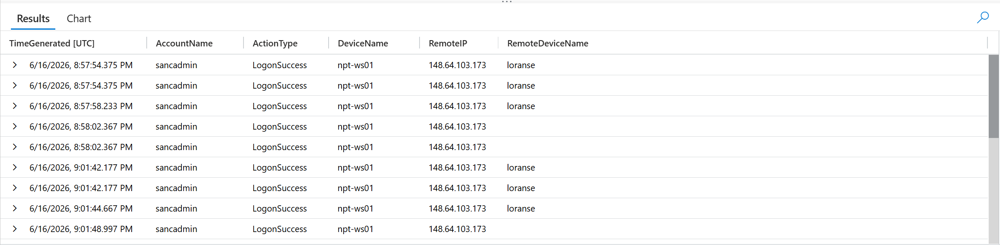

---

### 🚩 Flag 2: First Foothold, Ordering

**What to find:** The obvious read has Linux compromised first, then a pivot into Windows. Prove or disprove that assumption by placing the clean external RDP logon on the same timeline as the Linux activity. Which host, and from which address, actually came first?

| Field | Value |
|---|---|
| **Answer** | npt-ws01, 148.64.103.173 |
| **Time (UTC)** | 2026-06-16T20:57:54.3753897Z |

**Details:** Placing the clean external RDP logon on the same timeline as the Linux host's activity confirmed that npt-ws01, reached from 148.64.103.173, was the first foothold established, contradicting the assumption that the Linux box was accessed first.

**Query:** Same as Flag 1

---

### 🚩 Flag 3: Operator Workstation Name

**What to find:** Every remote session into the estate carries a detail that names the machine the operator connected from. Give it.

| Field | Value |
|---|---|
| **Answer** | loranse |
| **Time (UTC)** | 2026-06-16T20:57:54.3753897Z |

**Details:** The operator's client workstation name announced itself on every remote session into the estate, identifying the source machine used to connect via the clean external RDP foothold.

**Query:** Same as Flag 1

---

### 🚩 Flag 4: SRV01 Access Vector

**What to find:** The server didn't have to be pivoted into internally, it may have had its own way in. Confirm how npt-srv01 was actually reached, and by what method.

| Field | Value |
|---|---|
| **Answer** | RDP, 148.64.103.173, RemoteInteractive |
| **Time (UTC)** | 2026-06-16T20:58:02.3064708Z |

**Details:** Reviewing successful logons on npt-srv01 showed the server was reached directly from the same external source as the workstation, not pivoted to internally, confirming the server's own independent inbound RDP access vector.

**Query:**
```kql
DeviceLogonEvents
| where TimeGenerated between (datetime(2026-06-16 18:00:00) .. datetime(2026-06-17))
| where DeviceName has_any ("npt-ws01","npt-srv01")
| where ActionType == "LogonSuccess"
| order by TimeGenerated asc
| project TimeGenerated, AccountName, ActionType, DeviceName, RemoteDeviceName, RemoteIP, LogonType
```

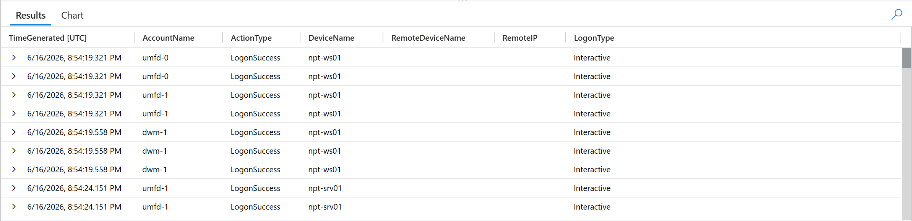

---

### Phase 02: Linux Recon & Tooling

### 🚩 Flag 5: Sudo Enumeration

**What to find:** Sort the sancadmin account's sudo commands on npt-linux01 chronologically. A malformed attempt comes right before the real one. Give the correct privilege-enumeration command that follows it.

| Field | Value |
|---|---|
| **Answer** | sudo -l |
| **Time (UTC)** | 2026-06-16T22:16:52.687226Z |

**Details:** Sorting sudo commands from the sancadmin account on npt-linux01 chronologically revealed a malformed typo attempt immediately followed by the correct privilege enumeration command, confirming the operator's real first escalation check.

**Query:**
```kql
DeviceProcessEvents
| where TimeGenerated between (datetime(2026-06-16 18:00:00) .. datetime(2026-06-17))
| where DeviceName == "npt-linux01"
| where isnotempty(ProcessCommandLine)
| where AccountName == "sancadmin"
| where FileName == "sudo"
| order by TimeGenerated asc
| project TimeGenerated, AccountName, FileName, ProcessCommandLine, InitiatingProcessCommandLine
```

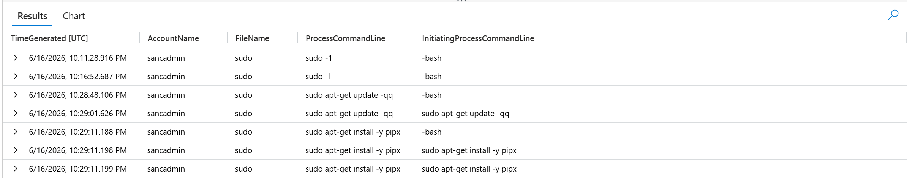

---

### 🚩 Flag 6: Reachability Technique

**What to find:** Before committing to a pivot, the operator tested whether the Windows estate was even reachable, without dropping a scanner. Name the technique, and the port it targeted.

| Field | Value |
|---|---|
| **Answer** | /dev/tcp, 3389 |
| **Time (UTC)** | 2026-06-16T22:21:29.008424Z |

**Details:** Reviewing DeviceNetworkEvents for sancadmin's activity on npt-linux01 showed reachability checks against the Windows estate performed via the /dev/tcp bash pseudo-device rather than any dropped scanning tool, with the traffic specifically targeting port 3389, signaling an intended RDP pivot.

**Query:**
```kql
DeviceNetworkEvents
| where TimeGenerated between (datetime(2026-06-16 18:00:00) .. datetime(2026-06-17))
| where DeviceName == "npt-linux01"
| where InitiatingProcessAccountName == "sancadmin"
| project TimeGenerated, Protocol, RemoteIP, RemoteIPType, RemotePort, InitiatingProcessCommandLine
| order by TimeGenerated asc
```

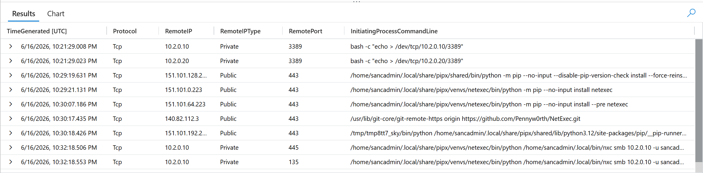

---

### 🚩 Flag 7: Operator Tooling

**What to find:** After confirming reachability, the operator installs something suited to the intended Windows pivot. Name it.

| Field | Value |
|---|---|
| **Answer** | netexec |
| **Time (UTC)** | 2026-06-16T22:29:19.265899Z |

**Details:** Filtering sancadmin's commands on npt-linux01 for install-related activity, after checks for a couple of capabilities, showed the operator committing to installing netexec, a tool suited for the intended Windows pivot.

**Query:**
```kql
DeviceProcessEvents
| where TimeGenerated between (datetime(2026-06-16 18:00:00) .. datetime(2026-06-17))
| where DeviceName == "npt-linux01"
| where isnotempty(ProcessCommandLine)
| where AccountName == "sancadmin"
| where ProcessCommandLine contains "install"
| distinct ProcessCommandLine
```

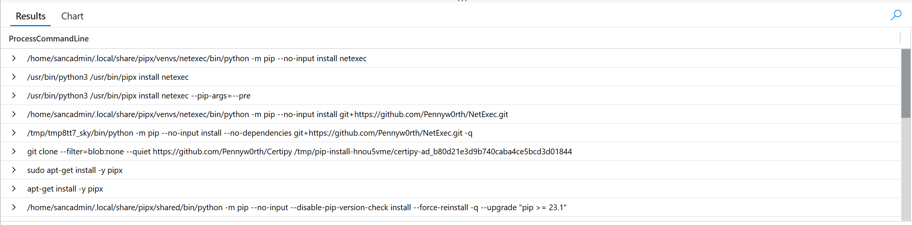

---

### Phase 03: Pivot, Execution, Persistence

### 🚩 Flag 8: Lateral Movement Triple

**What to find:** The internal hop back into the workstation has three parts: an account, a source address, and a destination host. Give all three.

| Field | Value |
|---|---|
| **Answer** | sancadmin, 10.2.0.30, npt-ws01 |
| **Time (UTC)** | 2026-06-16T22:32:18.5821153Z |

**Details:** Filtering successful logons on npt-ws01 for private RemoteIP sources identified the internal lateral movement hop back into the workstation, using the sancadmin account from a private internal source address after the Linux tooling stage.

**Query:**
```kql
DeviceLogonEvents
| where TimeGenerated between (datetime(2026-06-16 22:29:00) .. datetime(2026-06-17))
| where DeviceName == "npt-ws01"
| where ActionType == "LogonSuccess"
| where RemoteIPType == "Private"
| project TimeGenerated, AccountName, ActionType, LogonType, RemoteIP, DeviceName
| order by TimeGenerated asc
```

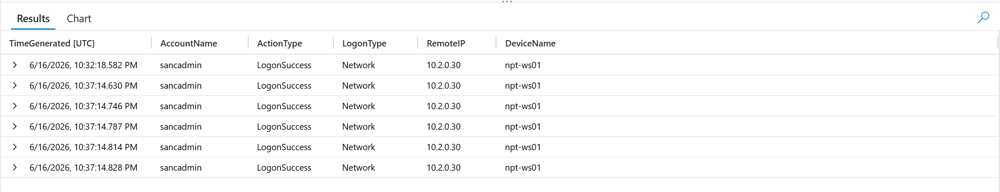

---

### 🚩 Flag 9: Operator PowerShell Lineage

**What to find:** Most of npt-ws01's PowerShell activity is the machine talking to itself. The operator's own hands-on-keyboard work has a different parent-process lineage entirely. Name the root of that lineage.

| Field | Value |
|---|---|
| **Answer** | Explorer.EXE |
| **Time (UTC)** | 2026-06-16T23:00:38.5443287Z |

**Details:** Reviewing sancadmin's process activity on npt-ws01 against the noise of machine-to-machine PowerShell showed a distinct parent-process lineage rooted in Explorer.EXE, separating the human operator's hands-on-keyboard activity from automated PowerShell traffic.

**Query:**
```kql
DeviceProcessEvents
| where TimeGenerated between (datetime(2026-06-16 22:29:00) .. datetime(2026-06-17))
| where DeviceName == "npt-ws01"
| where isnotempty(ProcessCommandLine)
| where AccountName == "sancadmin"
| order by TimeGenerated asc
| project TimeGenerated, AccountName, FileName, InitiatingProcessCommandLine
```

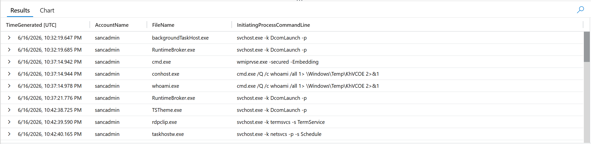

---

### 🚩 Flag 10: Persistence Full Command

**What to find:** After a few trial runs, the operator locks in logon persistence with a Run-key registry entry. Give the full command it points to.

| Field | Value |
|---|---|
| **Answer** | powershell.exe -NoProfile -WindowStyle Hidden -ExecutionPolicy Bypass -File "C:\ProgramData\Northpeak\NorthpeakSync\Bin\NorthpeakSyncTray.ps1" |
| **Time (UTC)** | 2026-06-16T23:04:16.721Z |

**Details:** After several trial runs of their staging script, the operator wrote a Run-key auto-start registry entry on npt-ws01 pointing to the staging script, establishing user-profile logon persistence that survives a reboot.

**Query:**
```kql
DeviceRegistryEvents
| where TimeGenerated between (datetime(2026-06-16 23:00:00) .. datetime(2026-06-17 04:00:00))
| where DeviceName == "npt-ws01"
| where RegistryKey has @"CurrentVersion\Run"
| project TimeGenerated, ActionType, RegistryKey, RegistryValueName, RegistryValueData, InitiatingProcessCommandLine
| order by TimeGenerated asc
```

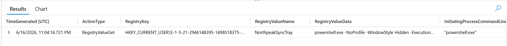

---

### Phase 04: Command & Control

### 🚩 Flag 11: Beacon Domains, Cross-Source

**What to find:** Only one look-alike C2 subdomain ever shows up in network telemetry. The other two only survive in process command lines. Name all three domains, and the table that recovers the two the network missed.

| Field | Value |
|---|---|
| **Answer** | status.sync-northpeak.com, updates.sync-northpeak.com, cdn.sync-northpeak.com; DeviceProcessEvents |
| **Time (UTC)** | N/A |

**Details:** Only one of the three look-alike subdomains ever appeared in DeviceNetworkEvents; the other two were absent from the network telemetry but recovered from process command-line references, revealing the full three-domain C2 channel and the order in which they were first contacted.

**Query:** Same as Flag 9

---

### 🚩 Flag 12: Encoded Beacon Decode

**What to find:** One beacon call is deliberately obfuscated. Decode it and give its true destination, parameters included.

| Field | Value |
|---|---|
| **Answer** | https://cdn.sync-northpeak.com/api/beacon?id=NPT-WS01&flag=NORTHPEAK-09 |
| **Time (UTC)** | 2026-06-16T23:19:22.922617Z |

**Details:** Decoding the deliberately obfuscated beacon revealed its true destination, a call to the cdn.sync-northpeak.com C2 subdomain with parameters identifying the compromised host and a unique flag value.

**Query:** Same as Flag 9

---

### 🚩 Flag 13: Encoded-Command Discrimination

**What to find:** Most of the encoded PowerShell on npt-ws01 isn't the operator at all, it's routine system chatter. Identify the process responsible for the noise, so the genuine operator-issued encoded commands can be isolated.

| Field | Value |
|---|---|
| **Answer** | gc_worker.exe |
| **Time (UTC)** | 2026-06-16T20:51:13.1939546Z |

**Details:** Filtering npt-ws01 for encoded PowerShell commands showed the overwhelming majority originating from gc_worker.exe, identified as routine system chatter rather than operator activity, allowing the few genuine operator-issued encoded commands to be isolated from the noise.

**Query:**
```kql
DeviceProcessEvents
| where TimeGenerated between (datetime(2026-06-16 18:00:00) .. datetime(2026-06-17 04:00:00))
| where DeviceName has_any ("npt-ws01")
| where ProcessCommandLine contains "-EncodedCommand"
| project TimeGenerated,DeviceName,AccountName,InitiatingProcessFileName,InitiatingProcessCommandLine
| order by TimeGenerated asc
```

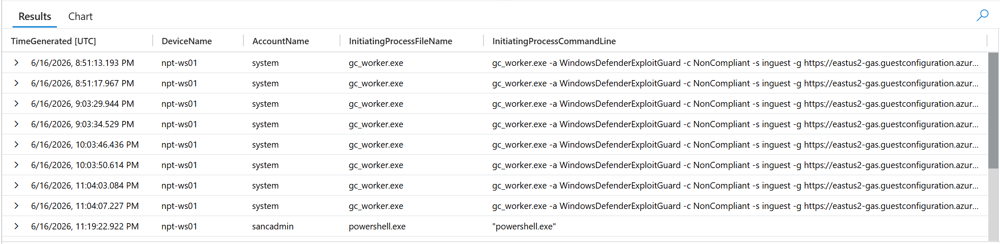

---

### 🚩 Flag 14: Beacon Rhythm

**What to find:** Look at the spacing between the earliest check-ins to the first C2 domain. Does the timing look human, or does it look automated? Characterise the rhythm.

| Field | Value |
|---|---|
| **Answer** | Periodic/regular intervals, automated beacon |
| **Time (UTC)** | N/A |

**Details:** The spacing between the early check-ins to the first C2 domain showed consistent, evenly-timed intervals rather than the irregular pattern of manual activity, indicating the channel was driven by automated, scheduled beaconing rather than a human operator triggering each request.

**Query:** From previous evidence

---

### Phase 05: Impact & Judgement

### 🚩 Flag 15: Crown Jewel Exfil

**What to find:** Somewhere on npt-srv01 sits the file the whole intrusion was for. Name it, the host it left from, and the C2 domain it went out through.

| Field | Value |
|---|---|
| **Answer** | customer_data_export_20260616.csv, npt-srv01, cdn.sync-northpeak.com |
| **Time (UTC)** | 2026-06-16T23:44:08.034865Z |

**Details:** File activity on npt-srv01 surfaced the crown-jewel export customer_data_export_20260616.csv, and correlating process activity for upload/transfer commands referencing that file confirmed it left the server bound for the cdn.sync-northpeak.com C2 domain.

**Query 1:**
```kql
DeviceFileEvents
| where TimeGenerated between (datetime(2026-06-16 23:00:00) .. datetime(2026-06-17 0:30:00))
| where DeviceName has_any ("npt-ws01","npt-srv01","npt-linux01")
| where InitiatingProcessAccountName == "sancadmin"
| where FileName !contains ".ps"
  and FileName !contains ".xml"
  and FileName !contains ".dll"
| project TimeGenerated, ActionType, FileName, FolderPath, DeviceName, InitiatingProcessAccountDomain
| order by TimeGenerated asc
```

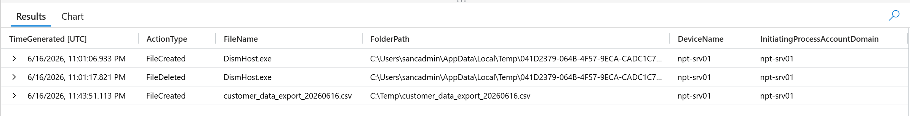

**Query 2:**
```kql
DeviceProcessEvents
| where TimeGenerated between (datetime(2026-06-16 23:40:00) .. datetime(2026-06-17 00:30:00))
| where DeviceName == "npt-srv01"
| where AccountName == "sancadmin"
| where ProcessCommandLine has_any ("customer_data_export", "upload", "curl", "wget", "Invoke-WebRequest")
| project TimeGenerated, FileName, ProcessCommandLine, InitiatingProcessCommandLine, InitiatingProcessSessionId
| order by TimeGenerated asc
```

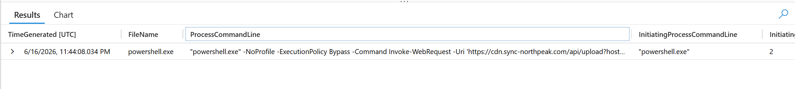

---

### 🚩 Flag 16: Exfil Session Correlation

**What to find:** Two remote sessions touched npt-srv01. Correlate the export activity's session ID against them: which session did the exfiltration actually happen in, the first connection or the one the operator returned through?

| Field | Value |
|---|---|
| **Answer** | Second |
| **Time (UTC)** | 2026-06-16T23:44:08.034865Z |

**Details:** Correlating the export activity's InitiatingProcessSessionId against the two remote sessions on npt-srv01 confirmed the exfiltration occurred during the second session, the one the operator returned through, not the initial connection.

**Query:** Same as Flag 15

---

### 🚩 Flag 17: Holding the Ground

**What to find:** They were hands-on for hours and nothing tripped. Check whether they tore the defences down to manage that, they didn't. So name the model: what they did NOT do to the environment (the absence), and what they used instead to operate.

| Field | Value |
|---|---|
| **Answer** | No security tampering or dropped binaries, native tools |
| **Time (UTC)** | N/A |

**Details:** Checking for any tampering with the security stack or dropped/installed binaries across the intrusion window returned nothing, confirming the operator never touched or disabled defenses. The entire operation was carried out using native, already-present tools (PowerShell, sudo, /dev/tcp, registry Run keys), letting them operate hands-on for hours without triggering the security tooling.

**Query:** N/A

---

### 🚩 Flag 18: Confirming the Foothold's Rights

**What to find:** Look at the very end of the operator's identity-check burst on npt-ws01. It goes further than a plain "who am I". What two things were they actually confirming about the sancadmin account?

| Field | Value |
|---|---|
| **Answer** | They were testing for administrator privileges, and they were checking what permissions they had in all of the groups they were in. |
| **Time (UTC)** | 2026-06-16T22:37:14.9786467Z |

**Details:** Reviewing the operator's short identity-check burst on npt-ws01 during the second session using `whoami` and `whoami.exe /groups` to see permissions across all the groups they were in, specifically confirming whether the sancadmin account held administrator privileges and enumerating its group membership and associated permissions.

**Query:**
```kql
DeviceProcessEvents
| where TimeGenerated between (datetime(2026-06-16 22:00:00) .. datetime(2026-06-17 00:30:00))
| where DeviceName == "npt-ws01"
| where AccountName == "sancadmin"
| where InitiatingProcessCommandLine  has_any ("cmd", "powershell")
| project TimeGenerated, FileName, ProcessCommandLine, InitiatingProcessCommandLine, InitiatingProcessSessionId
| order by TimeGenerated asc
```

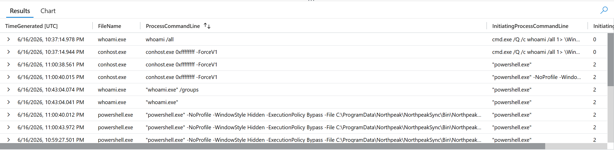

---

## 🛡️ Security Recommendations

1. **Alert on successful external interactive logons, not just failed-logon volume:** A clean, valid-account RDP entry can hide inside brute-force noise as a deliberate decoy. Tune detections toward successful public-IP RemoteInteractive sessions specifically, and treat a quiet successful logon sitting inside a loud failure spike as higher priority than the spike itself.

2. **Correlate living-off-the-land pivot and persistence indicators as a chain:** `/dev/tcp` reachability probes, netexec-class tool installs, Run-key registry writes, and PowerShell parented by Explorer.EXE rather than by system automation each look benign alone. Together, in sequence, they describe a pivot-to-persistence path worth alerting on as a set.

3. **Don't trust network telemetry alone to prove C2 visibility, and check the security stack itself.**
